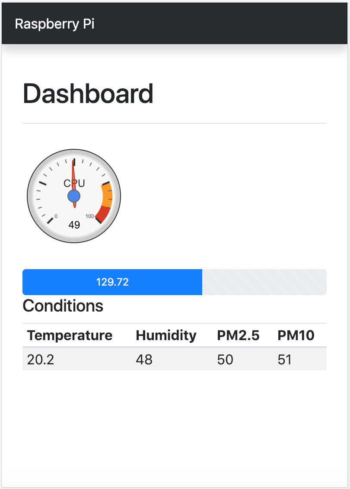

# piweb
A dashboard to show the CPU temperature, external disk storage usage as well as top 10 processes.

## PMS5003T
| Offset | Definition               | Data                                                                 |
| ------ |:------------------------:| --------------------------------------------------------------------:|
| 0      | Start byte 1             | Fixed 0x42 (char "B")                                                |
| 1      | Start byte 2             | Fixed 0x4D (char "M")                                                |
| 2      | Frame length (16 bits)   | Length = 13 * 2 + 2 (data + checksum)                                |
| 4      | Data 1 (16 bits)         | The PM1.0 concentration (CF = 1, standard particle), unit μg/m³      |
| 6      | Data 2 (16 bits)         | The PM2.5 concentration (CF = 1, standard particle), unit μg/m³      |
| 8      | Data 3 (16 bits)         | The PM10 concentration (CF = 1, standard particle), unit μg/m³       |
| 10     | Data 4 (16 bits)         | The PM1.0 concentration (generic atmospheric conditions), unit μg/m³ |
| 12     | Data 5 (16 bits)         | The PM2.5 concentration (generic atmospheric conditions), unit μg/m³ |
| 14     | Data 6 (16 bits)         | The PM10 concentration (generic atmospheric conditions), unit μg/m³  |
| 16     | Data 7 (16 bits)         | The number of particles with diameter => 0.3 μm in 0.1 liter of air  |
| 18     | Data 8 (16 bits)         | The number of particles with diameter => 0.5 μm in 0.1 liter of air  |
| 20     | Data 9 (16 bits)         | The number of particles with diameter => 1.0 μm in 0.1 liter of air  |
| 22     | Data 10 (16 bits)        | The number of particles with diameter => 2.5 μm in 0.1 liter of air  |
| 24     | Data 11 (16 bits)        | Temperature. Note: Real temperature = value / 10                     |
| 26     | Data 12 (16 bits)        | Humidity. Note: Real humidity = value / 10                           |
| 28     | Data 13 (8 bits)         | Version No.                                                          |
| 29     | Data 13 (8 bits)         | Error No.                                                            |
| 30     | Data 14 (16 bits)        | Checksum = sum(data[0:30])                                           |

#### Requirements
- Flask 1.0.2
- Python 3